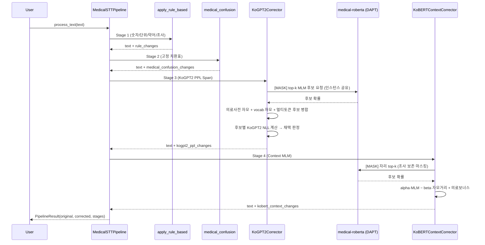

# 의료 STT 후처리 파이프라인

의료 음성 인식(STT) 결과의 오인식을 단계적으로 교정하는 직렬 파이프라인이다.  
구성: 결정적 규칙 → 고정 치환표 → KoGPT2 Perplexity 기반 스팬 교정 → DAPT RoBERTa 기반 문맥 MLM 교정.

구현 진입점은 `src/pipeline.py`의 `MedicalSTTPipeline.process_text()`.

---

## 1. 전체 구성

```text
입력 STT 텍스트
   │
   ▼
[Stage 1] Rule-based         ─ 결정적 규칙 (숫자/단위/약어/조사)
   │
   ▼
[Stage 2] Medical Confusion  ─ 의료용어 고정 치환표
   │
   ▼
[Stage 3] KoGPT2 PPL Span    ─ KoGPT2(NLL) + RoBERTa(MLM) 혼합
   │                           멀티토큰(2-subword) 양방향 조건부 MLM 포함
   ▼
[Stage 4] Context MLM        ─ DAPT KLUE-RoBERTa (자모 가중 스코어링)
   │
   ▼
[Stage 5] Span Reranker      ─ 2어절 멀티MASK 재랭킹 (기본 OFF, 실험용)
   │
   ▼
최종 교정 텍스트
```

각 스테이지는 **이전 스테이지의 출력을 입력**으로 받는다. 비활성 시 입력을 그대로 통과시키고 `stages[*]`에 `skipped: true`로 기록한다.

### 시퀀스 다이어그램



---

## 2. 사용 모델

| 용도 | 모델 | 출처 | 비고 |
|---|---|---|---|
| Autoregressive LM (NLL/PPL) | `skt/kogpt2-base-v2` | HuggingFace | 문장 자연스러움 채점 |
| MLM (문맥 후보) | `models/medical-roberta` | **자체 DAPT** | `klue/roberta-large` → 의료 도메인 파인튜닝 |
| DAPT 베이스 | `klue/roberta-large` | HuggingFace | DAPT 입력 |
| 자모 분해 | `jamo` 라이브러리 | pip | 한글 → 초·중·종성 |
| 편집거리 | `python-Levenshtein` | pip | 자모/문자 거리 |

Stage 3와 Stage 4는 **동일 RoBERTa 인스턴스**를 공유한다(`pipeline._get_kobert_context_corrector()` 캐시를 `KoGPT2Corrector(proposal_model=..., proposal_tokenizer=...)`로 주입). VRAM·로드 시간 중복 제거.

---

## 3. 도메인 적응 사전학습 (DAPT)

범용 `klue/roberta-large`가 의료 STT 오인식 후보 공간을 잘 덮지 못하는 문제를 해결하기 위해 자체 MLM 파인튜닝을 수행한다.

### 데이터 (`scripts/prepare_dapt_data.py`)
- 입력: `training_data/medsub/` 하위 JSON 재귀 (`간호사/`, `의사/`, `환자/`)
- 추출: `전사정보.LabelText`
- 필터:
  - `QualityStatus == "Good"`
  - 한글 포함 필수
  - 5자 이상
  - 전사 노이즈 제거 (`(웃음)`, `(기침)`, `[unintelligible]` 등)
- 분할: train 98% / eval 2% (eval 최소 1000개)
- 산출: `data/dapt_raw_train.txt`(38,677줄) / `data/dapt_raw_eval.txt`(1,000줄)

### 학습 (`scripts/run_dapt.py`)
| 항목 | 값 |
|---|---|
| Objective | MLM (`mlm_probability=0.15`, 동적 마스킹) |
| Collator | `DataCollatorForLanguageModeling` |
| per_device_train_batch_size | 16 |
| gradient_accumulation_steps | 4 (**effective batch 64**) |
| max_seq_length | 128 |
| num_train_epochs | 3 |
| learning_rate | 2e-5 |
| warmup_ratio | 0.06 |
| weight_decay | 0.01 |
| fp16 | True |
| evaluation_strategy / eval_steps | steps / 500 |
| save_steps | 500 |
| save_total_limit | 1 (디스크 절약) |
| save_only_model | True |
| load_best_model_at_end | True |

산출물: `models/medical-roberta/`. Stage 3의 MLM 후보 생성기 및 Stage 4의 문맥 교정 모델로 함께 사용.

---

## 4. Stage 1 — Rule-based (`src/rule_based.py`)

결정적·비학습 규칙. 오류 가능성이 낮은 패턴만 처리.

- **한글 숫자 → 아라비아**
  - `KOREAN_DIGIT`(영/공/일/…/구), `KOREAN_UNIT_MULTIPLIER`(십/백/천/만), `PURE_KOREAN_NUM`(하나/두/셋/…/아흔)
  - `SAFE_UNITS` + `CONTEXT_UNITS`로 단위 뒤 숫자만 변환 (문맥 오변환 방지)
  - 예: `오 분 → 5분`, `백육십에 백 → 160/100`
- **의료 단위 정규화**: `밀리그램→mg`, `씨씨→cc`, `퍼센트→%`, `센티미터→cm` 등
- **약어 전개**: `HTN→고혈압`, `DM→당뇨` (`ABBREVIATION_MAP`)
- **조사 교정**: `harmonize_josa` — 치환 결과의 받침에 맞춰 `이/가`, `은/는`, `을/를` 보정

---

## 5. Stage 2 — Medical Confusion (`src/medical_confusion.py`)

**STT 오인식 → 의료용어** 고정 치환표. 문맥 판단이 불필요한 명확한 매핑만.

```python
DEFAULT_MEDICAL_CONFUSION_SET = {
    "인구염": {"인후염"},
    "극성충수염": {"급성충수염"},
    "극성수수염": {"급성충수염"},
    "극성충수염입니다": {"급성충수염입니다"},
    "약풍": {"압통"},
    "돌중": {"통증"},
    "킥스": {"깁스"},
    "고석": {"고정"},
    "쳐단": {"처방"},
}
```

- 긴 키 우선 매칭으로 부분 치환 충돌 방지.
- 구어 오인식(`취한/체한`, `개를/배를` 등)은 여기가 아닌 Stage 3/4에서 처리.
- `MLM_SURFACE_BLOCKS`: `쪼이는/혹시/이번/수술을/수속하면/하나요/힘들어요` — **교정 금지 표면**으로 MLM 단계에 전달.

---

## 6. Stage 3 — KoGPT2 PPL Span Correction (`src/kogpt2_corrector.py`)

의심 어절에 대해 후보를 생성 → 문장을 재구성해 **KoGPT2 NLL(perplexity) 감소**로 채택 여부를 판정. 여기에 DAPT RoBERTa의 MLM 확률을 보조 척도로 섞는다.

### 6-1. 의심 어절 탐지
- 어절별 MLM 확률 하위 집합 + 자모거리 필터
- 용언 활용형(`looks_like_verb_conjugation`)·존대/반말 어미(`speech_endings_compatible`)는 스킵
- **`KOGPT2_PROTECTED_STEMS`**: 조사 분리 후 stem이 여기에 속하면 스킵
  - 의존명사·위치: `전/후/중/내/간/상/하/좌/우/초/말/초기/말기`
  - 1인칭 대명사: `제가/저는/저를/저도` (`제가→뭐가` 회귀 차단)

### 6-2. 후보 생성 (`_build_candidates`)
세 경로를 합집합으로 모으며 각 후보는 출처 태그(`medical` / `multi_only` / `vocab_only`)를 가진다.

1. **의료사전 자모 매칭**
   - `data/medical_dict.txt`(약 13,444개) 중 자모 편집거리 ≤ `max_jamo_distance=2`
2. **RoBERTa MLM top-k + 자모 필터**
   - 해당 어절을 `[MASK]`로 치환 후 top-`kogpt2_top_k=50` 중 자모거리 ≤ `roberta_max_jamo_distance=2`
3. **RoBERTa 전체 vocab 자모 스캔** (옵션, 기본 ON)
   - 전체 서브워드 vocab에서 MLM ≥ `roberta_vocab_mlm_floor=0.3` 이며 자모 거리 이내
   - 최대 `roberta_full_vocab_max_cand=512`
   - 의료사전에 없는 후보는 `vocab_only`로 태깅

### 6-3. 멀티토큰(2-subword) 후보 — 양방향 조건부 MLM

범용 MLM은 한 번에 1-MASK만 안정적으로 예측하므로, `타신→탓인`, `조이→쪽이`처럼 연속 2음절이 동시에 교정되는 케이스를 놓친다. 이를 잡기 위한 조건부 빔.

```
원문: "컨디션 타신 줄"
  step1: "컨디션 [MASK]신 줄" → top-k1=10 후보 (탓, 것, 그, …)
  step2: 각 c1에 대해 "컨디션 c1[MASK] 줄" → top-k2=12 후보
  joint_prob = p(c1) × p(c2 | c1)
  최대 multi_token_max_candidates=16개 보관
```

수용 조건 (모두 AND):

| 파라미터 | 값 | 의미 |
|---|---|---|
| `multi_token_enable` | True | 토글 |
| `multi_token_span_chars` | 2 | 원문 stem 정확히 2자 |
| `multi_token_min_joint_prob` | 5e-4 | 너무 드문 조합 컷 |
| `multi_token_max_orig_prob` | 1e-5 | 원문이 MLM상 정상이면 시도 금지 |
| `multi_token_accept_min_prob` | 1e-3 | 후보 절대 확률 하한 |
| `multi_token_accept_min_prob_ratio` | 10× | 후보/원문 확률비 하한 |
| `multi_token_nll_min_improve` | **0.01** | NLL 실제 개선 필수 — `없는→있는` 같은 의미반전 차단 |

### 6-4. 후보 채택 — NLL + MLM 타이브레이크

```python
for cand in candidates:
    nll_new = KoGPT2.score(reconstructed_sentence)
    improve = nll_orig - nll_new

    if cand ∈ medical_terms:
        # 의료 후보: MLM 충분(medical_relax_mlm_min_prob=0.05)하면
        # NLL이 max_nll_penalty_for_medical=0.6 이내 악화돼도 채택
    elif is_multi_only:
        # §6-3 AND 조건 + NLL ≥ 0.01 개선 필수
    elif is_vocab_only:
        # 일반 vocab 자모: NLL 개선 필수, MLM 타이브레이크 금지
    else:
        # 기타 일반 경로: improve ≥ kogpt2_min_improve(0.15)
        #                AND improve/|nll_orig| ≥ kogpt2_min_improve_ratio(0.05)

    # NLL 동률(±ε)이고 후보가 vocab_only가 아니며
    # MLM prob ≥ _MLM_TIE_MIN_PROB(0.05)면 MLM 타이브레이크 채택
```

- `kogpt2_min_span_chars=2`: 1자 어절 스킵.

---

## 7. Stage 4 — Context MLM (`src/kobert_context_corrector.py`)

DAPT RoBERTa로 단일 어절을 `[MASK]`로 치환하고, top-k 후보 중 **자모 가중 스코어**가 가장 높은 것을 선택.

### 7-1. 마스킹 전략
- 명사+격조사(`_USE_JOSA_MASK_PARTICLES = {을, 를, 이, 가, 은, 는, 에, 의, 와, 과, 로, 으로, 에서}`) → **조사 보존 마스킹**
  - `손을 → [MASK]을` (조사를 유지해 문법 안정)
- 그 외에는 어절 통째로 `[MASK]`

### 7-2. 점수식
```
score(cand) = alpha_mlm · log p_MLM(cand)
            − beta_jamo · jamo_edit_distance(orig, cand)
            + medical_bonus · 1[cand ∈ medical_terms]
```
- `alpha_mlm=1.0`, `beta_jamo=0.8`, `medical_bonus=0.25`
- `jamo_max_edit_distance=1` (보수적)
- `anomaly_threshold=0.01`: 원문 MLM 확률이 이 이하일 때만 교정 시도
- `max_word_edit_distance=2`, `min_span_chars=2`, `window_chars=72` (긴 문장 문맥 창)

### 7-3. 보호 장치
- `protected_surfaces={"수속", "수속하면"}`: 행정 용어 오교정 방지
- `MLM_SURFACE_BLOCKS` (Stage 2 공유): `쪼이는/혹시/이번/수술을/…` 동결
- `looks_like_verb_conjugation` / `speech_endings_compatible`: 문법 활용형 스킵
- `COMMON_STOPWORDS` (`src/jamo_corrector.py`): 후보 차단 리스트

사례: `마침에 → 아침에`, `이번 수속 → 입원 수속`.

---

## 8. Stage 5 — Span Reranker (`src/span_reranker.py`, 기본 OFF)

2어절 연속 영역에 여러 `[MASK]`를 두고 RoBERTa top-k 조합을 데카르트곱으로 펼쳐 KoGPT2 NLL로 재랭킹하는 실험 경로.

| 파라미터 | 값 |
|---|---|
| `span_reranker_span_words` | 2 |
| `per_mask_top_k` | 5 |
| `max_combinations` | 25 |
| `min_improve` | 0.1 |
| `min_improve_ratio` | 0.015 |

Stage 3의 멀티토큰 로직으로 대부분 대체 가능해 현재 비활성. 활성화 시 과교정 위험 큼.

---

## 9. 공용 유틸

### `src/korean_text_utils.py`
- `to_jamo(text)`: 한글을 자소 문자열로 변환
- `split_josa(word)`: 명사+체언 조사 분리
- `harmonize_josa(text)`: 치환 결과 받침에 맞춰 `이/가`, `은/는`, `을/를` 보정
- `looks_like_verb_conjugation(word)`: `VERB_FORM_ENDINGS`(면/고/서/며/니/지/도/만/…)로 활용형 추정
- `speech_endings_compatible(a, b)`: 존댓말/반말 어미 호환성 체크

### `src/jamo_corrector.py`
- `load_medical_dict(path)`: `data/medical_dict.txt` 로드
- `COMMON_STOPWORDS`: 의료 후보에서 제외할 일반어/행정어 (예: `수속`, `입원`, `아파요`)

---

## 10. 주요 파라미터 기본값 (`MedicalSTTPipeline`)

| 분류 | 파라미터 | 기본값 |
|---|---|---|
| 장치 | `device` | CUDA 가용 시 GPU, 아니면 CPU |
| KoGPT2 | `enable_kogpt2` | True |
|  | `kogpt2_model_name` | `skt/kogpt2-base-v2` |
|  | `kogpt2_top_k` | 40 |
|  | `kogpt2_max_jamo_distance` | 2 |
|  | `kogpt2_roberta_max_jamo_distance` | 2 |
|  | `kogpt2_roberta_vocab_mlm_floor` | 0.3 |
|  | `kogpt2_roberta_full_vocab_max_cand` | 512 |
|  | `kogpt2_min_improve` | 0.15 |
|  | `kogpt2_min_improve_ratio` | 0.05 |
|  | `kogpt2_min_span_chars` | 2 |
| 멀티토큰 | `kogpt2_multi_token_enable` | True |
|  | `kogpt2_multi_token_span_chars` | 2 |
|  | `kogpt2_multi_token_k1 / k2` | 10 / 12 |
|  | `kogpt2_multi_token_max_candidates` | 16 |
|  | `kogpt2_multi_token_min_joint_prob` | 5e-4 |
|  | `kogpt2_multi_token_nll_min_improve` | 0.01 |
|  | `kogpt2_multi_token_accept_min_prob` | 1e-3 |
|  | `kogpt2_multi_token_accept_min_prob_ratio` | 10.0 |
|  | `kogpt2_multi_token_max_orig_prob` | 1e-5 |
| Context MLM | `enable_kobert_context` | True |
|  | `kobert_model_name` | `models/medical-roberta` |
|  | `kobert_anomaly_threshold` | 0.01 |
|  | `kobert_top_k` | 50 |
|  | `kobert_max_word_edit_distance` | 2 |
|  | `kobert_jamo_max_edit_distance` | 1 |
|  | `kobert_min_span_chars` | 2 |
|  | `kobert_window_chars` | 72 |
| Span Reranker | `enable_span_reranker` | **False** |

---

## 11. 안전장치 — 알려진 위험과 방어

| 위험 | 방어 |
|---|---|
| 의미 반전 (`없는→있는`) | 멀티토큰 `nll_min_improve=0.01` + vocab_only MLM 타이브레이크 차단 |
| 1인칭 대명사 오교정 (`제가→뭐가`) | `KOGPT2_PROTECTED_STEMS`에 대명사 추가 |
| 의존명사 과교정 (`전→정`) | `KOGPT2_PROTECTED_STEMS` |
| 행정용어 오교정 (`수속→수술`) | `protected_surfaces`, `MLM_SURFACE_BLOCKS`, `COMMON_STOPWORDS` |
| 일반어 무제한 후보 | 자모거리 + MLM floor 이중 필터, `vocab_only` 태그로 엄격 게이트 |
| 문법 활용 오교정 | `looks_like_verb_conjugation`, 조사 보존 마스킹 |
| 모델 중복 로드 | Stage 3가 Stage 4 RoBERTa 인스턴스 주입 재사용 |
| 디스크 폭주 (학습) | `save_total_limit=1`, `save_only_model=True` |
| 보고서 JSON 파싱 실패 | `folder_before_after_report.py`에서 `json.loads(s, strict=False)` 사용 |

---

## 12. CLI (`main.py`)

### 공통
- `-i, --input`, `-o, --output`, `--dict`, `--device`, `-v`

### Stage 3 (KoGPT2)
- `--use-kogpt2` (기본 끔; `MedicalSTTPipeline` 클래스 기본값은 켜짐)
- `--kogpt2-model`, `--kogpt2-top-k`, `--kogpt2-max-jamo-distance`
- `--kogpt2-min-improve`, `--kogpt2-min-span-chars`

### Stage 4 (Context MLM)
- `--no-kobert-context` (기본 켬)
- `--kobert-model`, `--kobert-anomaly-threshold`, `--kobert-top-k`
- `--kobert-min-cand-prob`, `--kobert-max-word-edit`, `--kobert-min-span-chars`
- `--kobert-window`

---

## 13. 결과 JSON (`PipelineResult.to_dict()`)

```json
{
  "original": "...",
  "corrected": "...",
  "stages": {
    "rule_based":        { "output": "...", "changes": [...] },
    "medical_confusion": { "output": "...", "changes": [...] },
    "kogpt2_ppl":        { "output": "...", "changes": [...] },
    "kobert_context":    { "output": "...", "changes": [...] },
    "span_reranker":     { "output": "...", "changes": [...],
                            "skipped": true, "reason": "disabled_or_missing_models" }
  }
}
```

각 `changes[i]`는 `original`, `corrected`, 선택적 `edit_distance`, `confidence`, `improve`(NLL개선) 포함.

---

## 14. 보조 스크립트

| 스크립트 | 용도 |
|---|---|
| `scripts/prepare_dapt_data.py` | DAPT 학습/평가 데이터 생성 |
| `scripts/run_dapt.py` | DAPT 학습 실행 |
| `scripts/trace_pipeline_stages.py` | 단문 입력의 스테이지별 교정 추적 (디버그) |
| `scripts/folder_before_after_report.py` | `test_inputs/` 전체 전후 비교 `.md` 생성 |

---

## 15. 기법 요약표

| 기법 | 단계 | 목적 |
|---|---|---|
| 결정적 정규화 | 1 | 숫자·단위·약어·조사 |
| 고정 치환표 | 2 | 명확 의료용어 오인식 |
| KoGPT2 PPL / NLL | 3, (5) | 문장 자연스러움 채점 |
| RoBERTa MLM top-k | 3, 4 | 문맥 기반 후보 생성 |
| RoBERTa 전체 vocab 자모 스캔 | 3 | 사전 밖 후보 확대 |
| 양방향 조건부 MLM (2-subword) | 3 | 연속 음절 동시 교정 |
| 자모 편집거리 (jamo + Levenshtein) | 3, 4 | 발음 유사도 필터 |
| 의료사전 보너스 | 4 | 의료 후보 선호 |
| 조사 보존 마스킹 | 4 | 문법 안정성 유지 |
| 용언 활용 스킵 | 3, 4 | 문법형 과교정 방지 |
| DAPT (MLM 파인튜닝) | 0 | 의료 도메인 적응 |
| MLM 타이브레이크 | 3 | NLL 동률 시 의료 후보 우선 |
| Stem/표면 보호 리스트 | 3, 4 | 대명사·의존명사·행정어 동결 |

---

## 16. 한계 및 열린 이슈

- 문맥·후보 품질은 모델·사전·임계값 설정에 민감. 과교정 게이트 강화 시 누락 증가 가능.
- Stage 5 Span Reranker는 현재 실험 상태. 켤 경우 과교정 위험.
- 멀티토큰 후보는 2-subword까지만 커버 (3자 이상 연속 교정은 미지원).
- KoGPT2는 짧은 2-글자 교정의 PPL 차이를 구분하기 어려워, 멀티토큰은 MLM 척도를 1차 채택 기준으로 사용.
